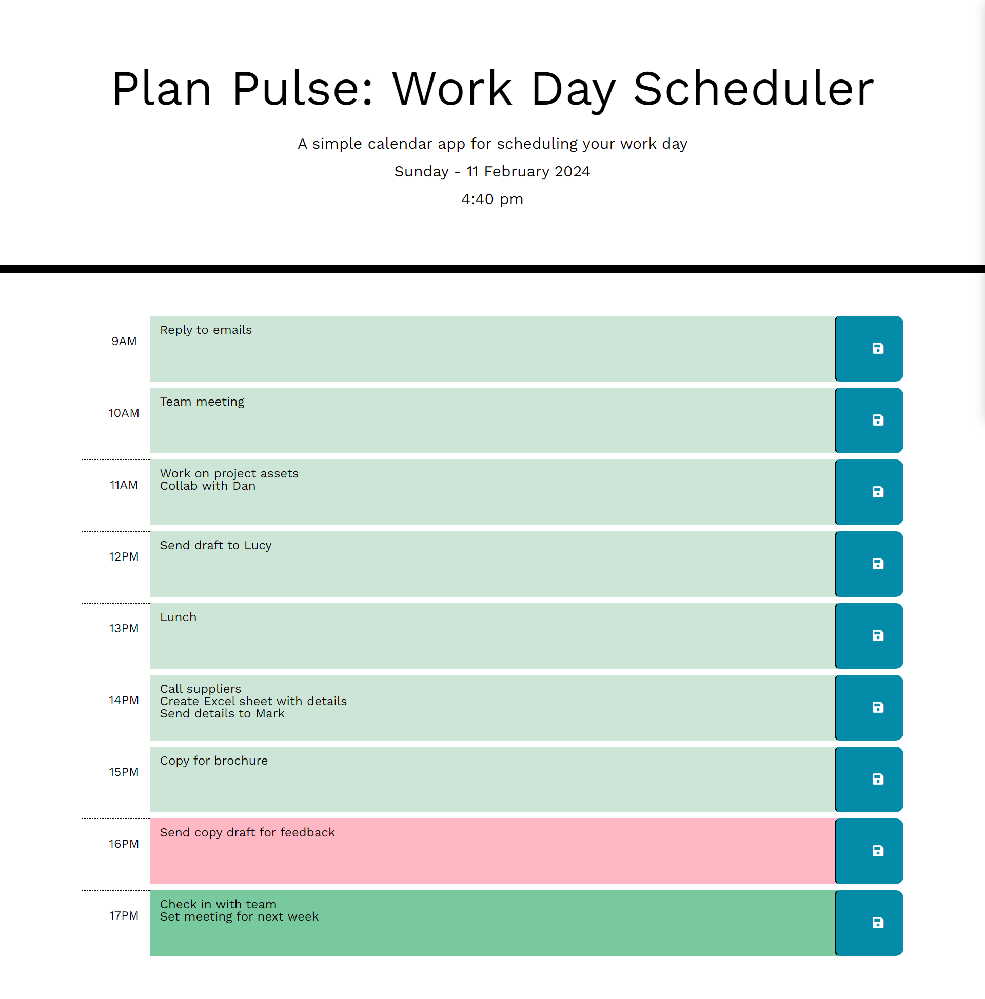

# Plan-Pulse: A Work Day Scheduler 📃✅

## Deployed Website Link
https://digitallyalex.github.io/plan-pulse/

## Description
A daily planner for employees with a busy schedule, to help them input their daily tasks by the hour and keep track of time.

## Installation
N/A

## Usage 

Users can input their plans into the text areas relevant to each time of the working day. Then, they can click the save button so they make sure to not lose the input if they close the page and open it again, or if they refresh it.
The dates and times are automatically updated, with colour-coding to signal the time that has passed, the current hour, and the remaining working time.

## Credits
Overall instruction and provision of necessary materials for this project from the EdX Front-End Web Development Bootcamp instructor and teaching assistants (Oct2023 Cohort).

Additionally, a few resources and tutorials were very helpful in guiding me towards the completion of this task:
- For colour pallette: https://coolors.co/
- For the chosen font: https://fonts.google.com/specimen/Work+Sans?preview.text=Plan%20Pulse:%20Work%20Day%20Planner
- DayJs documentation: https://day.js.org/docs/en/display/format
- On Local Storage: https://developer.mozilla.org/en-US/docs/Web/API/Window/localStorage

Badges at the bottom of this README file were listed with the help of the following repository: https://github.com/Ileriayo/markdown-badges

## License 
MIT License

Copyright (c) 2024 Alexandra Asanache

Permission is hereby granted, free of charge, to any person obtaining a copy of this software and associated documentation files (the "Software"), to deal in the Software without restriction, including without limitation the rights to use, copy, modify, merge, publish, distribute, sublicense, and/or sell copies of the Software, and to permit persons to whom the Software is furnished to do so, subject to the following conditions:

The above copyright notice and this permission notice shall be included in all copies or substantial portions of the Software.

THE SOFTWARE IS PROVIDED "AS IS", WITHOUT WARRANTY OF ANY KIND, EXPRESS OR IMPLIED, INCLUDING BUT NOT LIMITED TO THE WARRANTIES OF MERCHANTABILITY, FITNESS FOR A PARTICULAR PURPOSE AND NONINFRINGEMENT. IN NO EVENT SHALL THE AUTHORS OR COPYRIGHT HOLDERS BE LIABLE FOR ANY CLAIM, DAMAGES OR OTHER LIABILITY, WHETHER IN AN ACTION OF CONTRACT, TORT OR OTHERWISE, ARISING FROM, OUT OF OR IN CONNECTION WITH THE SOFTWARE OR THE USE OR OTHER DEALINGS IN THE SOFTWARE.

## Badges
     	